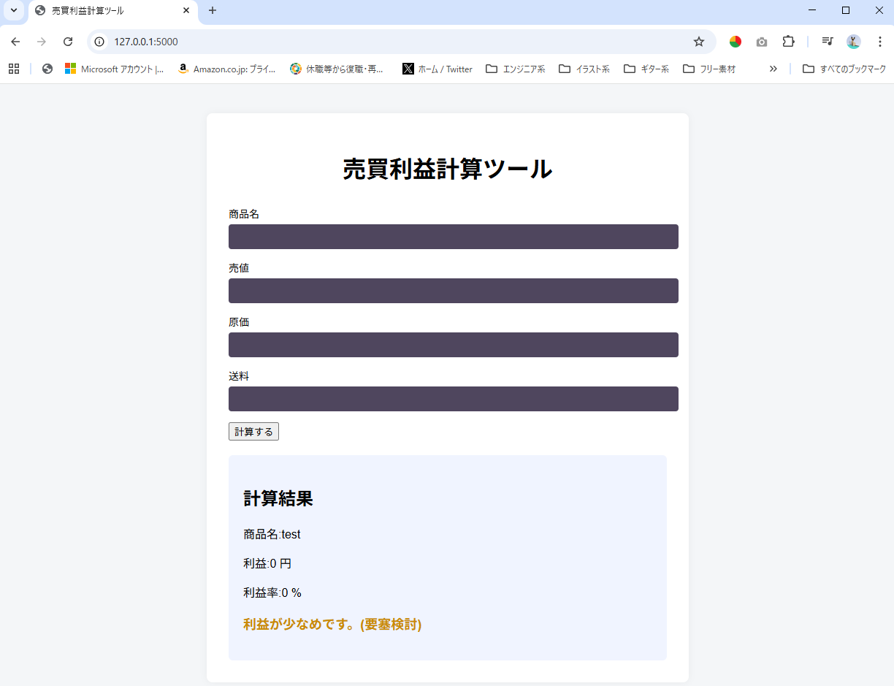
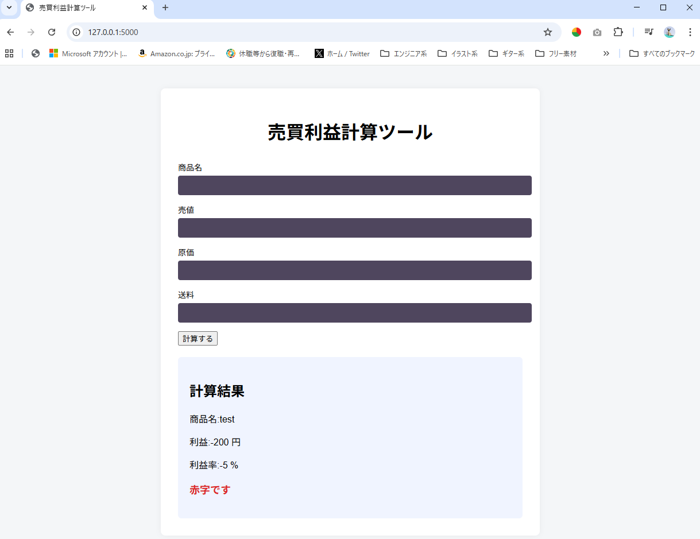

# フリマ出品向け 売買利益計算ツール（Webアプリ）
売買時（メルカリ等の出品前）に、  
売値・原価・送料から利益と利益率を計算する簡易ツールです。  
Python（Flask）で作成しています。  
※ 本ツールは学習目的で作成した個人開発アプリです。  

## できること
- 売値・原価・送料の入力
- 利益・利益率の計算
- 赤字／低利益／出品候補の判定表示

## 使用技術
- Python
- Flask

## 概要
売値・原価・送料を入力すると、利益と利益率を計算する簡易Webアプリです。

## 想定ユーザー
メルカリ・ヤフオク等で商品を仕入れて販売する個人出品車向けの、出品前の利益確認ツールです。

## 環境
- Python 3.10 以上
- Flask

## セットアップ
### 仮想環境作成
python -m venv venv

### 仮想環境有効化
Windows:
venv\Scripts\activate

Mac:
source venv/bin/activate

### 依存関係インストール
pip install -r requirements.txt

## フォルダ構成(仮想環境を作成した場所によって異なりますが以下を推奨)
flask/  
├ myenv/←上記コマンドで作成した仮想環境（こちらはGit管理しない）  
flask_test/  
 ├ app.py  
 └ index.html  
 └ .gitignore  
 └ requirements.txt  
    └ templates/  

### 起動
python app.py

上記実行後、以下へコマンドラインに表示されるアドレス(以下デフォルト)へアクセス  
http://127.0.0.1:5000/  

## 関数のテスト
簡単なテスト関数(手動確認用)も含まれます。コメントアウトによりON,OFFする想定です。  
ソースコード部分  
"if __name__ == "__main__":  
    test_judge()  # 確認したいときだけ有効化  
    app.run(debug=True)"  

## 実行イメージ(スクリーンショットを貼る予定)  
### 出品候補の例
#### 出品候補

#### 利益が少なめ

#### 赤字の例

## 使い方
1. 売値・原価・送料を入力
2. 「計算」ボタンを押す
3. 利益と判定（赤字／利益が少なめ／出品候補）を確認

 ## 今後の改善
- テストをpytestに置き換える（検討）
- 履歴のCSV保存
- 入力フォームのUI改善
- デプロイ