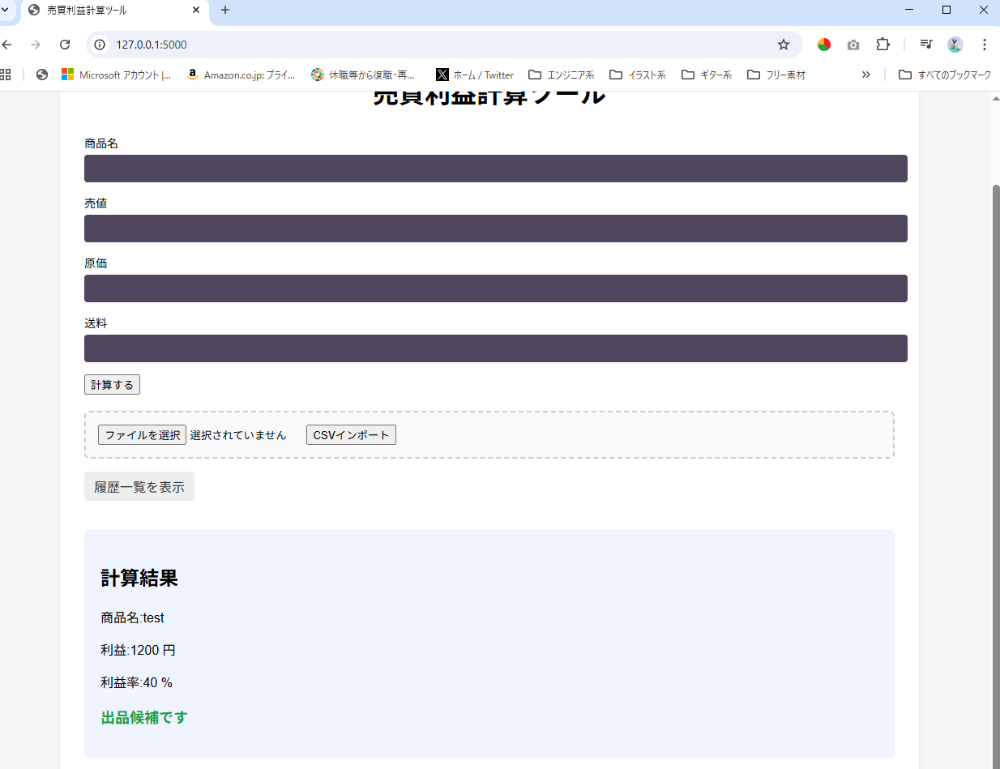
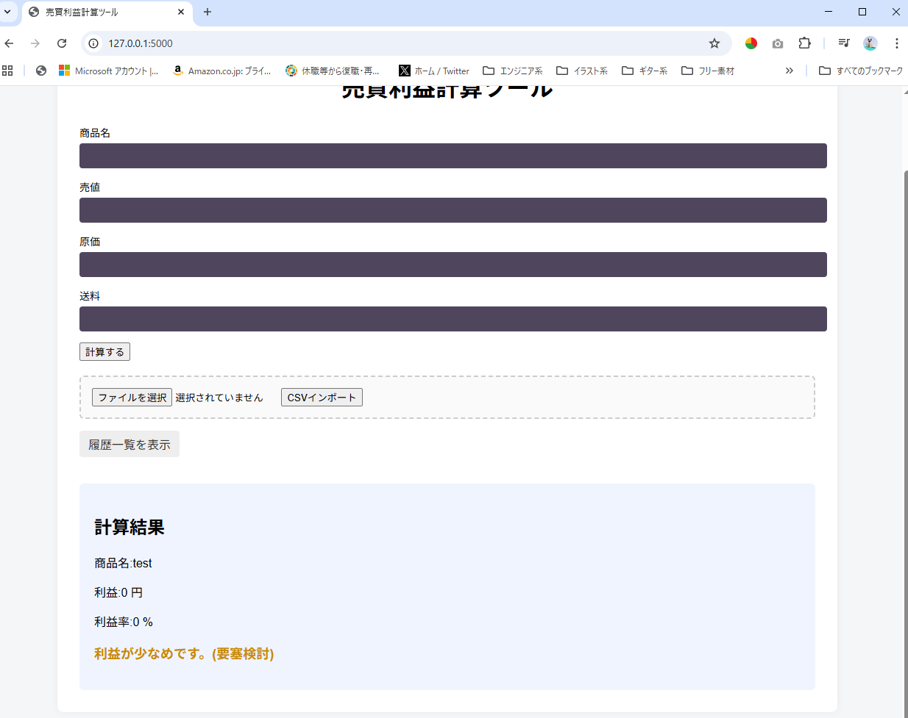
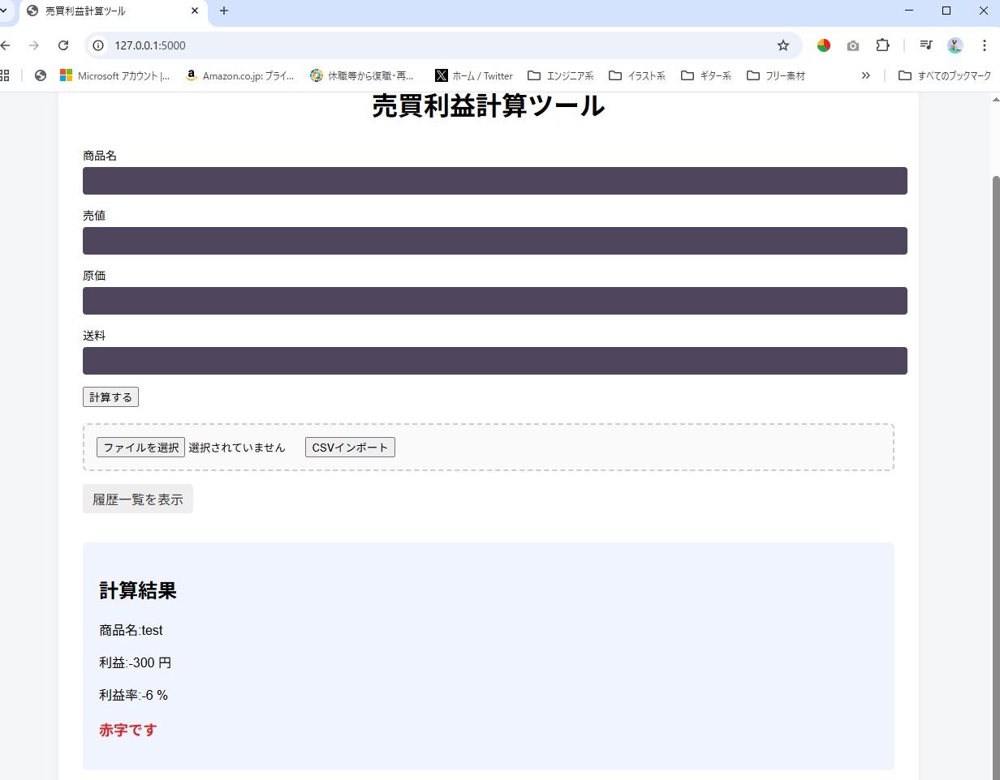

# MyResaleTool_Flask
## フリマ出品向け 売買利益計算ツール（Webアプリ）
売買時（メルカリ等の出品前）に、  
売値・原価・送料から利益と利益率を計算する簡易ツールです。  
Python（Flask）で作成しています。  
※ 本ツールは学習目的で作成した個人開発アプリです。  

## できること
- 売値・原価・送料の入力
- 利益・利益率の計算
- 赤字／低利益／出品候補の判定表示

## 使用技術
- Python
- Flask

## 概要
売値・原価・送料を入力すると、利益と利益率を計算する簡易Webアプリです。

## 想定ユーザー
メルカリ・ヤフオク等で商品を仕入れて販売する個人出品車向けの、出品前の利益確認ツールです。

## 環境
- Python 3.10 以上
- Flask

## セットアップ
### 仮想環境作成
python -m venv venv

### 仮想環境有効化
Windows:
venv\Scripts\activate

Mac:
source venv/bin/activate

### 依存関係インストール
pip install -r requirements.txt

## フォルダ構成(仮想環境を作成した場所によって異なりますが以下を推奨)
flask/  
├ myenv/←上記コマンドで作成した仮想環境（こちらはGit管理しない）  
flask_test/    
├─docs  
│  └─****.png (実行時のスクリーンショット各種)    
├─logs  
│  └─app.log  
├─output  
│  └─output.csv  
│  └─test_input.csv (importテスト用のデータ)  
├─static  
│  └─css  
├─templates  
│  └ index.html  
│  └ history.html  
└─test  
│  └─logig_test.py  
├ app.py  
├ logic.py  
└ requirements.txt  
└ .gitignore  

### 起動
python app.py

上記実行後、以下へコマンドラインに表示されるアドレス(以下デフォルト)へアクセス  
http://127.0.0.1:5000/  

## 主な機能
1. 商品名,価格,原価,送料の入力値を受け取り、利益,利益率を出し、出品対象となるかどうかの判定を行う。  
2. 1の処理をcsvファイルによるインポートを行うことで、複数件同時に行うことができる。
3. 履歴をoutput以下にcsv形式で保持し、プログラム内で読み取ることができる。
4. 3のcsv形式の履歴を削除することができる。(1つずつor全件同時)
5. 3のcsv形式の履歴をエクスポートすることができる。

## 簡易設計
app.py(flaskのエントリーインポート)
	∟index  
	∟history  
	∟delete_all  
	∟delete  
	∟download  
	∟import  
	
logic.py(CSV処理/計算及び判定/フィルタ・ソート機能)
	∟calc_profit (利益計算関数)  
	∟write_csv (csvファイルへの書き込みを行う)  
	∟csv_write_control (csvファイルの書き込みの複数or単体の制御を行う)  
	∟load_csv (csvファイルの読み込み)  
	∟judge_profit (買時購入の判定処理)  
	∟input_exe (入力値に対する処理)  
	∟history_sort (ソート機能)  
	∟history_filter (フィルタ機能)  

## 関数のテスト
簡単なテスト関数(手動確認用)も含まれます。コメントアウトによりON,OFFする想定です。  
ソースコード部分  
"if __name__ == "__main__":  
    test_judge()  # 確認したいときだけ有効化  
    app.run(debug=True)"  

## 実行イメージ(スクリーンショットは更新予定)  
### 出品候補の例
#### 出品候補

#### 利益が少なめ

#### 赤字の例

### その他のスクリーンショット
flask_test/docs/以下に格納  

## 使い方
1. 売値・原価・送料を入力
2. 「計算」ボタンを押す
3. 利益と判定（赤字／利益が少なめ／出品候補）を確認

 ## 今後の改善
 2026/1/18で一旦区切りをつける
 以下項目に関しては次回以降のアプリ開発で取り組めたらいいなという案
- テストをpytestに置き換える
- デプロイ
- 継続課題  
	∟docstring(プログラムの解説)やコメントの記述をする  
	∟見直し＆追記を行う  
- DB実装  
	∟flaskとの共存を考える  
- 動的なページの実装  
	∟Javascriptとかphpを駆使すること  